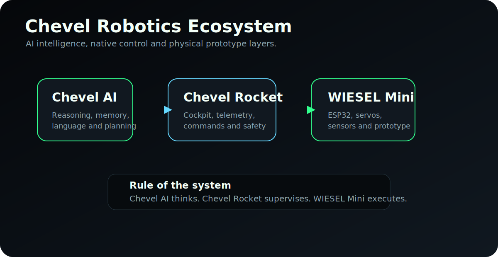

<h1 align="center">Chevel Rocket</h1>

<p align="center">
  <strong>Native robotics control center for the Chevel ecosystem.</strong>
</p>

<p align="center">
  
  
  
  
  
</p>

<p align="center">
  <a href="#overview">Overview</a> |
  <a href="#ecosystem">Ecosystem</a> |
  <a href="#features">Features</a> |
  <a href="#wiesel-mini">WIESEL Mini</a> |
  <a href="#architecture">Architecture</a> |
  <a href="#local-build">Local build</a> |
  <a href="#documentation">Docs</a>
</p>

---

## Overview

Chevel Rocket is the native robotics control center of the Chevel ecosystem.

Chevel AI is the intelligence layer. It handles reasoning, memory, language, planning and tool use.

Chevel Rocket is the robotics layer. It handles the cockpit interface, telemetry, supervision, safety states and future hardware integration.

The first physical target is **WIESEL Mini**, a small low-cost prototype used to validate movement, telemetry, emergency states and the hardware bridge before larger robotic platforms.

---

## Ecosystem

<p align="center">
  
</p>

```text
Chevel AI
  -> goals, intent and planning
Chevel Rocket
  -> supervision, telemetry and safe robot commands
Hardware Bridge
  -> USB serial or local Wi-Fi integration
WIESEL Mini / WIESEL-E
  -> physical prototype and future robotic platform
```

Short rule:

```text
Chevel AI thinks.
Chevel Rocket supervises.
WIESEL Mini executes the prototype layer.
```

---

## Features

### Native Cockpit

- Qt 6 + QML native desktop interface.
- C++ backend/controllers.
- Industrial/cockpit screen structure.
- Command panel, logs, telemetry and system status.

### Simulation Layer

- Simulated telemetry during runtime.
- Robot health panel.
- Gauge-based system indicators.
- Camera/map placeholder for future integration.

### Safety Boundary

- `RobotCommandInterface` separates UI actions from robot commands.
- Double confirmation for critical actions.
- Emergency state control always visible.
- Clear separation between simulation mode and hardware mode.

### Development Diagnostics

- QML startup diagnostics in `main.cpp`.
- `--test-window` mode to validate Qt/QML startup.
- Local QML fallback strategy for development.

---

## WIESEL Mini

WIESEL Mini is the first planned physical prototype for validating the robotics stack.

It is intentionally small, low-cost and modular. Its purpose is not industrial strength. Its purpose is to prove that Chevel Rocket can supervise a real physical prototype.

Initial target hardware:

- ESP32 DevKit V1 ESP-WROOM-32.
- PCA9685 16-channel PWM servo driver.
- MG90S micro servos.
- 5V 5A servo power supply.
- Emergency stop button.
- Status LEDs.
- MDF, acrylic, PVC or reused material for structure.

Related files:

- [WIESEL Mini Prototype](docs/WIESEL_MINI.md)
- [Parts List](hardware/wiesel-mini/parts-list.md)
- [Wiring Guide](hardware/wiesel-mini/wiring.md)
- [ESP32 Firmware Draft](hardware/wiesel-mini/firmware/esp32_wiesel_mini.ino)

---

## Architecture

```text
chevel-rocket/
|-- CMakeLists.txt
|-- main.cpp
|-- src/
|   |-- RobotCommandInterface.*
|   |-- RobotController.*
|   `-- TelemetryModel.*
|-- qml/
|   |-- Main.qml
|   |-- TestWindow.qml
|   `-- components/
|-- docs/
|   |-- ARCHITECTURE.md
|   |-- BUILD_WINDOWS.md
|   |-- CHEVEL_AI_INTEGRATION.md
|   |-- HARDWARE_PROTOCOL.md
|   |-- WIESEL_MINI.md
|   `-- assets/
|-- hardware/
|   `-- wiesel-mini/
|       |-- parts-list.md
|       |-- wiring.md
|       `-- firmware/
`-- README.md
```

---

## Tech Stack

| Layer | Technology |
| --- | --- |
| Native app | C++17 |
| Interface | Qt 6 + QML |
| UI controls | Qt Quick Controls |
| Build | CMake + Ninja |
| Windows toolchain | MSVC 2022 64-bit |
| Prototype bridge | ESP32 planned |
| Servo driver | PCA9685 planned |
| First robot | WIESEL Mini |

---

## Local Build

Use **x64 Native Tools Command Prompt for VS 2022**.

Required tools:

- Visual Studio Build Tools 2022 / MSVC v143.
- Windows SDK.
- CMake.
- Ninja.
- Qt 6.11.1 MSVC 2022 64-bit.

Known working Qt path:

```text
C:\Qt\6.11.1\msvc2022_64
```

Configure and build:

```powershell
cd /d "C:\Users\mackson\OneDrive\Documentos\New project"
cmake -S . -B build -G "Ninja" -DCMAKE_PREFIX_PATH="C:\Qt\6.11.1\msvc2022_64"
cmake --build build
```

Deploy Qt DLLs for local execution:

```powershell
C:\Qt\6.11.1\msvc2022_64\bin\windeployqt.exe --debug --qmldir qml build\ChevelRobotControlCenter.exe
```

Run:

```powershell
.\build\ChevelRobotControlCenter.exe
```

Test minimal Qt/QML window:

```powershell
.\build\ChevelRobotControlCenter.exe --test-window
```

---

## Documentation

- [Architecture](docs/ARCHITECTURE.md)
- [Windows Build Guide](docs/BUILD_WINDOWS.md)
- [WIESEL Mini Prototype](docs/WIESEL_MINI.md)
- [Hardware Protocol Draft](docs/HARDWARE_PROTOCOL.md)
- [Chevel AI Integration](docs/CHEVEL_AI_INTEGRATION.md)
- [WIESEL Mini Parts List](hardware/wiesel-mini/parts-list.md)
- [WIESEL Mini Wiring](hardware/wiesel-mini/wiring.md)
- [ESP32 Firmware Draft](hardware/wiesel-mini/firmware/esp32_wiesel_mini.ino)

---

## Roadmap

### Native app

- Stabilize the Qt/QML cockpit.
- Add official Chevel Rocket images supplied by the project.
- Separate simulation and hardware modes clearly.
- Add better diagnostics for QML startup and runtime state.

### Robotics

- Build WIESEL Mini.
- Connect ESP32 over USB serial.
- Read telemetry from the prototype.
- Send supervised movement commands.
- Add emergency stop feedback.

### Chevel ecosystem

- Connect Chevel AI to Chevel Rocket through high-level intent.
- Keep hardware actions supervised by Chevel Rocket.
- Prepare future support for larger WIESEL-E/U platforms.

---

## Maintainer

Developed by **Mackson Victor** as part of the Chevel ecosystem.

<p align="center">
  <strong>Chevel Rocket</strong><br />
  Native robotics control center for the Chevel ecosystem.
</p>
