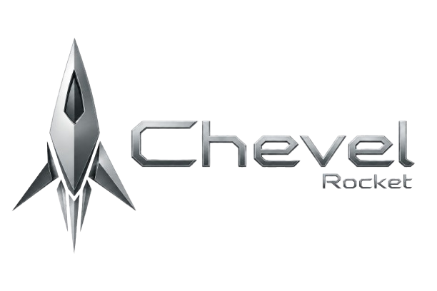
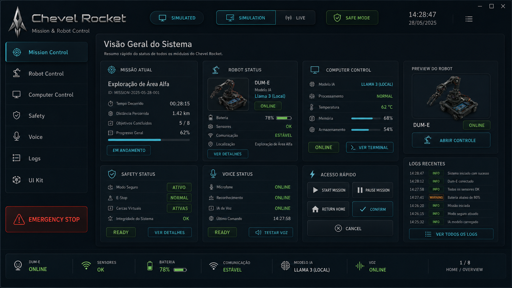
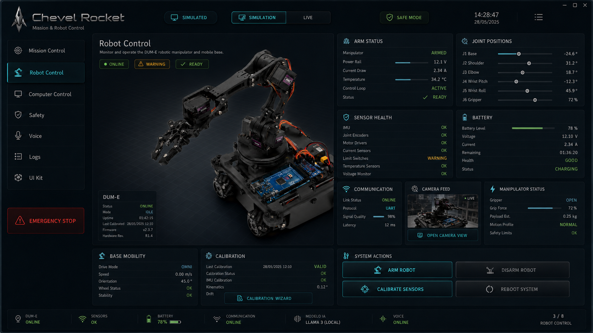
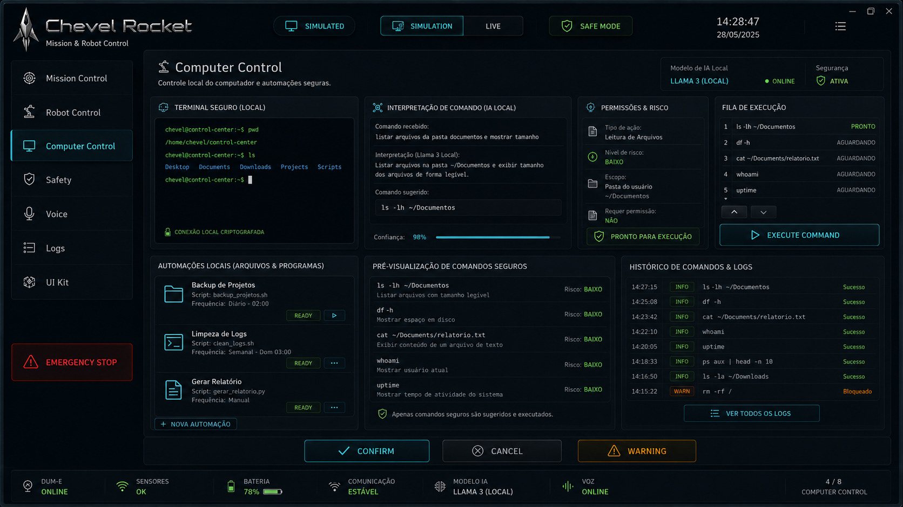
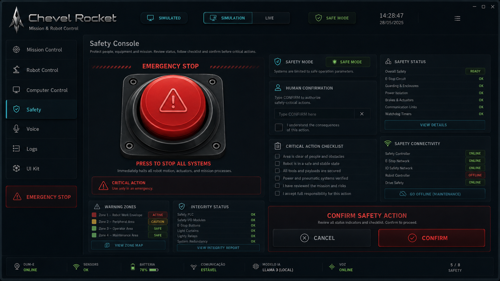
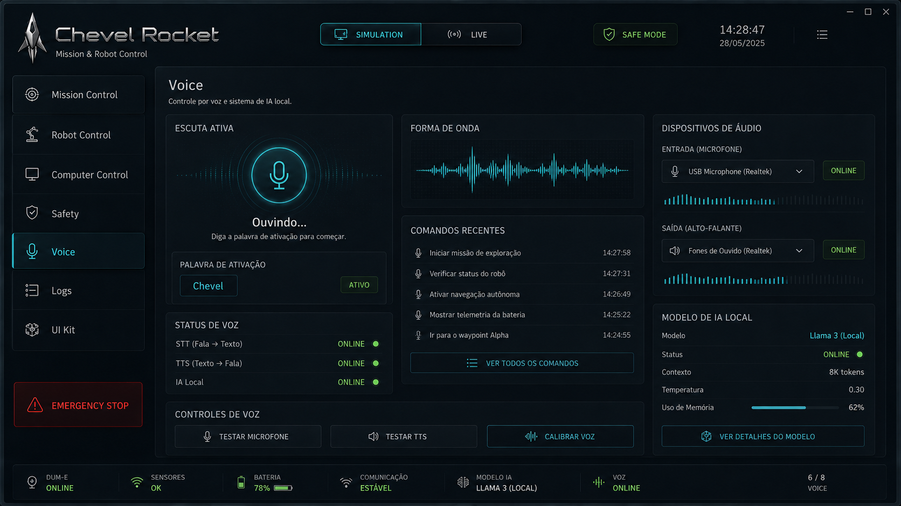
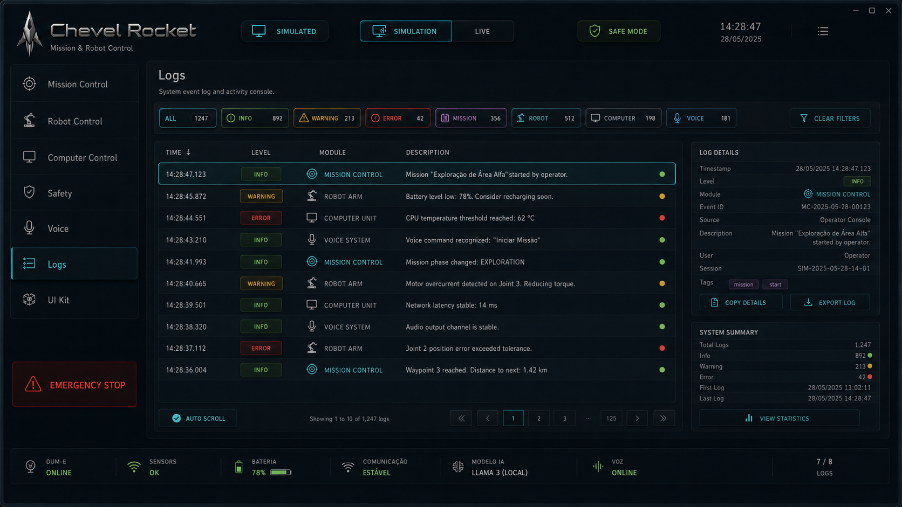
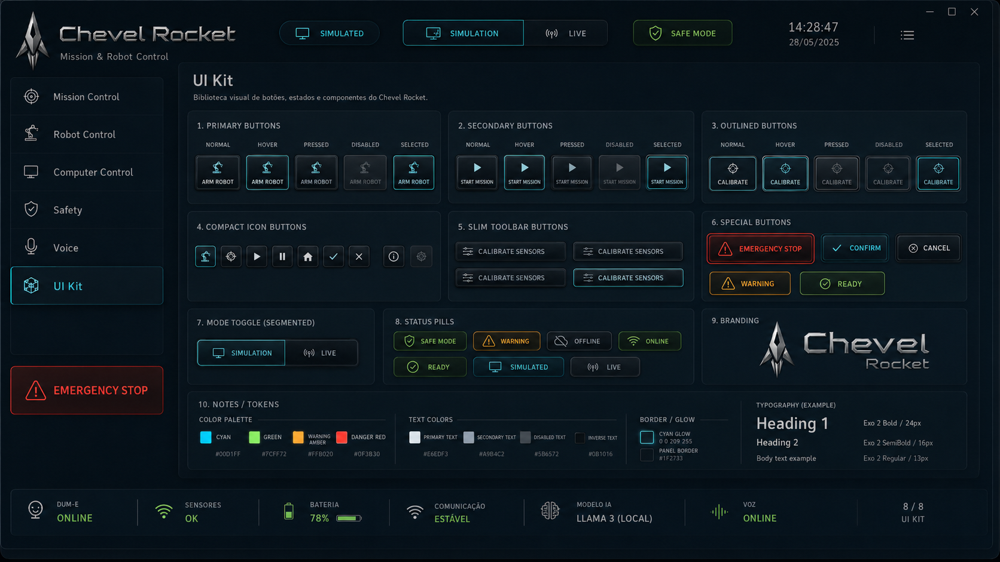
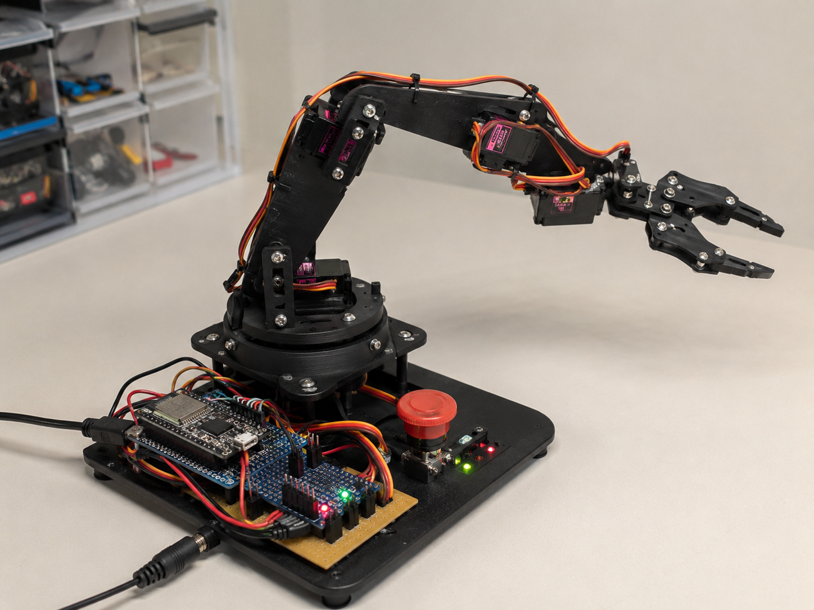

<p align="center">
  
</p>

<h1 align="center">Chevel Rocket</h1>

<p align="center">
  <strong>Native robotics control center for the Chevel ecosystem.</strong>
</p>

<p align="center">
  
  
  
  
  
  
</p>

<p align="center">
  <a href="#overview">Overview</a> |
  <a href="#official-gallery">Gallery</a> |
  <a href="#ecosystem">Ecosystem</a> |
  <a href="#interface-modules">Modules</a> |
  <a href="#wiesel-mini">WIESEL Mini</a> |
  <a href="#architecture">Architecture</a> |
  <a href="#local-build">Build</a> |
  <a href="#roadmap">Roadmap</a>
</p>

---

## Overview

Chevel Rocket is the native robotics control center of the Chevel ecosystem.

Chevel AI is the intelligence layer: reasoning, memory, language, planning and tool use. Chevel Rocket is the robotics layer: cockpit interface, telemetry, supervision, safety states and future hardware integration.

The first physical target is **WIESEL Mini**, a low-cost prototype used to validate movement, telemetry, emergency states and the hardware bridge before larger robotic platforms.

```text
Chevel AI thinks.
Chevel Rocket supervises.
WIESEL Mini executes the prototype layer.
```

---

## Official Gallery

### Mission Control

<p align="center">
  
</p>

### Robot Control

<p align="center">
  
</p>

### Computer Control

<p align="center">
  
</p>

### Safety Console

<p align="center">
  
</p>

### Voice

<p align="center">
  
</p>

### Logs

<p align="center">
  
</p>

### UI Kit

<p align="center">
  
</p>

### WIESEL Mini Prototype Direction

<p align="center">
  
</p>

---

## Ecosystem

<p align="center">
  
</p>

```text
Chevel AI
  -> goals, intent and planning
Chevel Rocket
  -> supervision, telemetry and safe robot commands
Hardware Bridge
  -> USB serial or local Wi-Fi integration
WIESEL Mini / WIESEL-E
  -> physical prototype and future robotic platform
```

| Module | Role |
| --- | --- |
| Chevel AI | intelligence, reasoning and planning |
| Chevel Rocket | robotics control, supervision and safety |
| Hardware Bridge | device communication layer |
| WIESEL Mini | first physical prototype |
| WIESEL-E/U | future larger platform |

---

## Interface Modules

- **Mission Control**: global overview, mission state, robot status, AI model and quick actions.
- **Robot Control**: manipulator status, joints, sensors, battery, communication and system actions.
- **Computer Control**: local command execution, permission review, queue and safe automation.
- **Safety**: emergency stop, human confirmation, checklist and safety connectivity.
- **Voice**: active listening, waveform, voice command history and local AI voice status.
- **Logs**: searchable event history, filters, event details and export path.
- **UI Kit**: visual system for buttons, status pills, tokens, typography and reusable components.

---

## Current Status

Implemented now:

- Qt 6 + QML native desktop interface.
- C++ backend/controllers.
- CMake + Ninja build.
- Industrial/cockpit screen structure.
- Simulated telemetry during runtime.
- Robot health, gauges, command panel and logs.
- Safety boundary through `RobotCommandInterface`.
- Double confirmation for critical actions.
- Emergency state control.
- QML startup diagnostics in `main.cpp`.
- `--test-window` mode to validate Qt/QML startup.

Planned next:

- Real hardware bridge experiment.
- USB serial protocol with ESP32.
- WIESEL Mini telemetry feedback.
- Chevel AI high-level intent integration.
- Windows test release packaging.

---

## WIESEL Mini

WIESEL Mini is the first planned physical prototype for validating the robotics stack.

It is intentionally small, low-cost and modular. Its purpose is not industrial strength. Its purpose is to prove that Chevel Rocket can supervise a real physical prototype.

Initial target hardware:

- ESP32 DevKit V1 ESP-WROOM-32.
- PCA9685 16-channel PWM servo driver.
- MG90S micro servos.
- 5V 5A servo power supply.
- Emergency stop button.
- Status LEDs.
- MDF, acrylic, PVC or reused material for structure.

Related files:

- [WIESEL Mini Prototype](docs/WIESEL_MINI.md)
- [Parts List](hardware/wiesel-mini/parts-list.md)
- [Wiring Guide](hardware/wiesel-mini/wiring.md)
- [ESP32 Firmware Draft](hardware/wiesel-mini/firmware/esp32_wiesel_mini.ino)

---

## Architecture

```text
chevel-rocket/
|-- CMakeLists.txt
|-- main.cpp
|-- src/
|-- qml/
|-- docs/
|   |-- assets/
|   |   |-- branding/
|   |   |-- diagrams/
|   |   |-- screenshots/
|   |   `-- prototypes/
|   |-- ARCHITECTURE.md
|   |-- BUILD_WINDOWS.md
|   |-- CHEVEL_AI_INTEGRATION.md
|   |-- HARDWARE_PROTOCOL.md
|   `-- WIESEL_MINI.md
|-- hardware/
|   `-- wiesel-mini/
`-- README.md
```

---

## Tech Stack

| Layer | Technology |
| --- | --- |
| Native app | C++17 |
| Interface | Qt 6 + QML |
| UI controls | Qt Quick Controls |
| Build | CMake + Ninja |
| Windows toolchain | MSVC 2022 64-bit |
| Prototype bridge | ESP32 planned |
| Servo driver | PCA9685 planned |
| First robot | WIESEL Mini |

---

## Local Build

Use **x64 Native Tools Command Prompt for VS 2022**.

Required tools:

- Visual Studio Build Tools 2022 / MSVC v143.
- Windows SDK.
- CMake.
- Ninja.
- Qt 6.11.1 MSVC 2022 64-bit.

Known working Qt path:

```text
C:\Qt\6.11.1\msvc2022_64
```

Configure and build:

```powershell
cd /d "C:\Users\mackson\OneDrive\Documentos\New project"
cmake -S . -B build -G "Ninja" -DCMAKE_PREFIX_PATH="C:\Qt\6.11.1\msvc2022_64"
cmake --build build
```

Deploy Qt DLLs for local execution:

```powershell
C:\Qt\6.11.1\msvc2022_64\bin\windeployqt.exe --debug --qmldir qml build\ChevelRobotControlCenter.exe
```

Run:

```powershell
.\build\ChevelRobotControlCenter.exe
```

Test minimal Qt/QML window:

```powershell
.\build\ChevelRobotControlCenter.exe --test-window
```

---

## Documentation

- [Architecture](docs/ARCHITECTURE.md)
- [Windows Build Guide](docs/BUILD_WINDOWS.md)
- [WIESEL Mini Prototype](docs/WIESEL_MINI.md)
- [Hardware Protocol Draft](docs/HARDWARE_PROTOCOL.md)
- [Chevel AI Integration](docs/CHEVEL_AI_INTEGRATION.md)
- [Official Assets Guide](docs/ASSETS_GUIDE.md)
- [WIESEL Mini Parts List](hardware/wiesel-mini/parts-list.md)
- [WIESEL Mini Wiring](hardware/wiesel-mini/wiring.md)
- [ESP32 Firmware Draft](hardware/wiesel-mini/firmware/esp32_wiesel_mini.ino)

---

## Roadmap

### Native app

- Stabilize the Qt/QML cockpit.
- Separate simulation and hardware modes clearly.
- Add better diagnostics for QML startup and runtime state.
- Prepare Windows test releases.

### Robotics

- Build WIESEL Mini.
- Connect ESP32 over USB serial.
- Read telemetry from the prototype.
- Send supervised movement commands.
- Add emergency stop feedback.
- Add camera and sensor experiments.

### Chevel ecosystem

- Connect Chevel AI to Chevel Rocket through high-level intent.
- Keep hardware actions supervised by Chevel Rocket.
- Prepare future support for larger WIESEL-E/U platforms.
- Keep Chevel Rocket focused on robotics, not general AI.

---

## Maintainer

Developed by **Mackson Victor** as part of the Chevel ecosystem.

<p align="center">
  <strong>Chevel Rocket</strong><br />
  Native robotics control center for the Chevel ecosystem.
</p>
